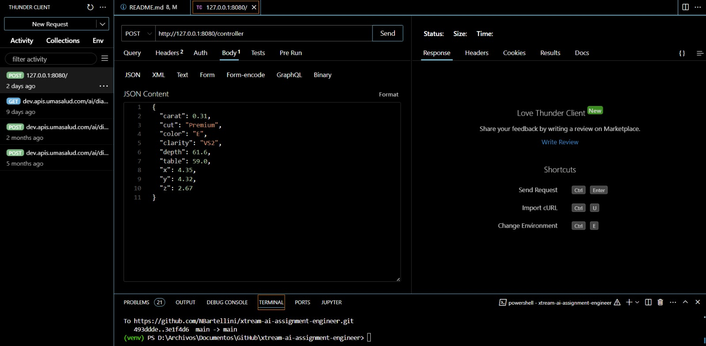
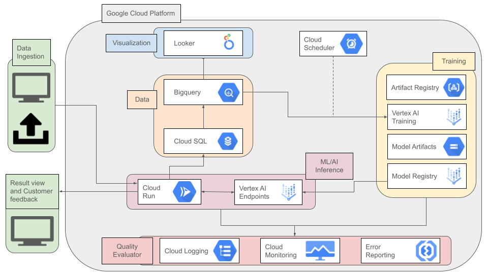

# xtream AI Challenge

## How to run

To run the scripts in this repository, you must have Python installed in version 3.10.10 and Pyenv to manage environments. You can also find a guide on installing Pyenv [here](https://realpython.com/intro-to-pyenv/).

Once installed, navigate to the folder with  `cd xtream-ai-assignment-engineer`.

If you are working on Linux, run the script ["build_env_linux.sh"](build_env_linux.sh) with the following command in the terminal: `.\build_env_linux.sh`, which will create the environment with the necessary requirements to run the scripts.  If you are working on Windows, run the analogous script ["build_env_windows.sh"](build_env_windows.ps1) with the following command in the terminal: `.\build_env_windows.ps1`.

Note: Since this challenge covered exploratory data analysis, model training, and the creation of training pipelines and REST APIs, the requirements file contains all the necessary libraries for these steps to use a single environment to facilitate running the code without having to activate and deactivate environments for each challenge. However, to better organize the repository inside the company, I would create a separate GitHub folder within the organization solely for research and exploratory model training, another separated for an automated training pipeline so that it could be deployed to cloud services, and a third folder for deployment for inference. This way, each of them would have their own requirements and environment. It would optimize the eventual deploy with less space in the container since it would only install libraries that would use.

## Challenges
### Diamonds

**Problem type**: Regression

**Dataset description**: [Diamonds Readme](./datasets/diamonds/README.md)

The first step was to perform an exploratory analysis of the Diamonds dataset. This was done in a Jupyter notebook [EDA](./exploring/EDA.ipynb) , which is located within the folder named 'exploring'.

The purpose of the EDA was to understand the dataset's characteristics and its state in order to perform an intermediate cleaning step and use the data for training. The tasks performed included:

* Univariate analysis of categorical and numerical variables

General metrics such as mean, standard deviation, and quantiles for numerical variables were visualized; frequency of categorical values and their most frequent value were visualized too and distributions were plotted using histograms and boxplots.
Not having a uniform distribution of data characteristics and price would lead to biases in model learning and overfitting models to certain characteristics and values.
While this occurs, regularization techniques can avoid these issues, and in a second instance, data could be added through an experienced person who tags new data to re-train the model.

* Cleaning of duplicate and correcting erroneous values

Duplicate rows are removed from the dataframe. For negative price values, it was decided to estimate their value based on the price of another diamond with similar characteristics to the diamond with the erroneous value. Another solution would be to also remove them.

* Relationship between categorical variables with Chi2

The Chi2 test is a statistical test whose null hypothesis posits that there is no association between the evaluated variables since the distributions of the frequencies of these variables differ. Since for each association the p-value < 0.05, the null hypothesis was rejected, therefore, there is an association between the variables and they are not independent of each other.

* Encoding of categorical variables for later use in ML models

* Visualization of variables in relation to price (label)
  
* Visualization of the correlation of all variables in the dataset with the encoded categorical variables

The variables that show a strong correlation with the price of diamonds are the height (x), width (y), and depth (z). The rest of the variables were not discarded for model training, as they may provide information for a better fit to the data.

* Split the dataset into train and test sub-datasets with a partition of 0.8-0.2

#### Challenge 1

**Assignment**: Create a Jupyter notebook where you develop and evaluate a model that predicts a gem's worth based on its characteristics.

With this analysis, we proceeded to train a couple of models, this step is developed in th following file: [training](./exploring/trainig.ipynb). Although there are many models for tabular data training, three were chosen: Linear Regression Model, RandomForest Model, and XGBoost model.

Linear Regression Model was chosen as it is a basic, simple and easily interpretable model. The other two are well-known performative models for tabular tasks. They also provide feature analysis for it's optimization, they can capture non-linear relationships between label and variables, and also provides regularization techniques to prevent overfitting.

Another solution it would have been to use Autogluon or any librery that performs automated AutoML. But from experience, deploying models with this library in particular can it be expensive in terms of memory since the models requires Autogluon pipelines too. For a simpler and quicker solution, I decided to do an automated grid search with multiple parameters, different evaluation metrics (MSE or MAE) and data normalization/tranformation. This would allow me to get the best model possible. Other variation included for model training was using the best features though feature importance analysis or all variables.

The models' performance was evaluated using a variety of metrics, including mean absolute error (MAE), root mean squared error (RMSE), coefficient of determination (R2), and mean absolute percentage error (MAPE) both for training dataset and testing dataset. The results of different models and metrics were compared to select the model with the best overall performance.

The results of each iteration were saved: [here](./exploring/results_best_models.csv). As analyzed, XGBoost is the best model and also metrics won't vary so much in multiple iterations. So the simplest iteartion was selected as best model given XGBoost has the best performance among the three models with the lowest error metrics and the highest R^2, which means it fits the data well and has good predictive power.

However, since the model isn't improving over the iterations, some possible reasons could be:

* The data: there could be more variations between which variables to choose that the one selected. It could also be the quality of this data, given that distributions for many are not normal.
* The problem might need more complex models. There are multiple models that can be tried yet: neural netwroks, LightGBM, etc.

#### Challenge 2

**Assignment**: Develop an automated pipeline that trains your model with fresh data.

Note: Since I don't own an account of Google Services but that's mainly what I'm used to work with, I developed the functions for data downloading if data were in a bucket in Google Storage or in a table in BigQuery, those lines are commented as they were not tested or ran. This way it can be automatized with other services.

The pipeline includes the steps explained in EDA and training section. Other features in the future I could be add are the fine-tuning of old models with new data, add more models to the pipelines and an automatized deployment to a platform.

The default path to the data considers the folder organization in this repository. Also the results of training are saved in a csv.

To run this pipeline:

```bash
python ./training/main.py [-h] -download {csv,storage,bigquery} [-data_path DATA_PATH] [--model {XGBoost,Linear,bigquery}] [--model_path MODEL_PATH]
               [--new_train_split NEW_TRAIN_SPLIT]


  -h, --help            show this help message and exit
  -download {csv,storage,bigquery}
                        Choose from where to download the data.
  -data_path DATA_PATH  Path to the data when loaded in csv.
  --model_path MODEL_PATH
                        Path to save model
  --new_train_split NEW_TRAIN_SPLIT
                        Do the data split train/test.
```

#### Challenge 3

**Assignment**: Build a REST API to integrate your model into a web app, making it a cinch for his team to use.

In challenge 3, run the API REST with the following command in the terminal: `python -m src.main`.

After running the code in local, to request the API, I particularly use an extension in Visual Studio Code called: ThunderClient.  So, generate a new request, choose POST method and fill the URL with a dictionary similar to this example:

```python
{
  "carat": 0.31,
  "cut": "Premium",
  "color": "E",
  "clarity": "VS2",
  "depth": 61.6,
  "table": 59.0,
  "x": 4.35,
  "y": 4.32,
  "z": 2.67
}
```

Hit send and it should provide you a prediction. For better understanding, I provide you a screen capture from the extension used in my VSC:



#### Challenge 4

**Assignment**: Using your favorite cloud provider, either AWS, GCP, or Azure, design cloud-based training and serving pipelines.
You should not implement the solution, but you should provide a **detailed explanation** of the architecture and the services you would use, motivating your choices.



The pipeline will start with data ingestion, provided by a front end that will load the files by communicating through a service hosted on Cloud Run. This service serves not only for updating the inventory but also for predicting the final price in real time containing the whole code with Docker containers and linking it's developing with multiple services like Cloud Build, Artifact Registry and Github. Cloud Run will be responsible for processing, cleaning, transforming the files into the required input format for storage and prediction. Alongside with Cloud SQL it will update de database and mantain it.

Storage will be done through BigQuery since the dataset Diamonds presents tabular and structured data. Through this, queries can be made. To analyze the data, prepare it for training, and save the prediction results, as well as a label provided in the iterative model tuning phase by a reviewer.

Within the inference part, Cloud Run will make a request to Vertex endpoints where the initial model will be deployed to make predictions according to the entered data. The endpoint will make the prediction and return the value to the same container in Cloud Run, which will communicate with a web application, the front end, to display the predicted price and obtain feedback from the reviewer during the iteration phase. Both the feedback and the prediction will be stored within the table architecture in BigQuery.

An automation will be scheduled with Cloud Scheduler every certain period (to be determined) for regular model training with the data loaded through the system and the feedback obtained from the reviewer. This will impact the model training and management service, which is composed first of an initial container in the Artifact Registry that will be used to build the Vertex AI Training service for the XGBoost model. The artifacts generated in training, both the model and the metadata, will be stored in Model Artifacts. From the best model, a new version of the model will be built in Vertex Model Registry and then redeployed.

Finally, we have two components. The first is a database visualization to provide users with information on model results and diamond characteristics using Looker dashboards. On the other hand, we have the monitoring and logging module. Through the Quality evaluator, the quality of predictions from the deployed model can be evaluated. Cloud Logging, Monitoring, and Error Reporting services will be essential for maintaining training pipelines, data loading, and prediction, diagnosing errors, and performance issues in the model.